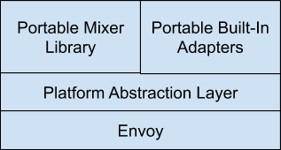

> 备注： 内容摘自 [Mixer V2 Architecture](https://docs.google.com/document/d/1QKmtem5jU_2F3Lh5SqLp0IuPb80_70J7aJEYu4_gS-s/edit#)

Istio 计划对 Policy 和 Telemetry 进行改造：

- Mixer-In-Proxy/Mixer合并进Proxy。 Mixer 将用C ++重写并直接嵌入到Envoy。 将不再有任何独立的 Mixer 服务。 这将提高性能并降低运维复杂性。

- Protocol Capture/协议捕获。Mixer 将能够捕获网格中运行的工作负载使用的任意协议，并通过Mixer 的转换和输出管道发送相关数据。 这将为运维提供灵活性，以完全控制现有工作负载的行为。

- 改变载荷。 适配器将能够检查和改变请求负载。 这将启用许多中介场景。

- 简化的配置模型。 我们将允许运维直接配置适配器的输入，从而降低配置系统的复杂性。 这种方法完全消除 Mixer V1 中所需的一整套配置。

## Mixer V1

Mixer V1是在网格中运行的独立服务，旨在抽象基础设施后端，其中基础设施后端是Stackdriver或New Relic之类的东西。 Sidecars和网关调用Mixer执行前置条件检查，以确定是否允许请求继续（Check），并在请求完成后报告遥测（Report）。

Mixer 通过第一方和第三方适配器接口动态连接到基础设施后端。Mixer的配置确切地决定在哪个时间将哪些数据发送到哪个后端。

### Adapter Models

适配器在 mixer 设计的整个生命周期中经历了多次转变：

- **Demand-Loaded/按需加载**. 我们最初希望使适配器成为可在 Mixer 进程中运行的按需加载的共享库。 但是，创建 Mixer 的Go环境对共享库没有足够的支持。

- **Statically Linked/静态链接**. 然后我们回到二进制适配器。 添加或删除适配器需要重新构建 Mixer 二进制文件。 考虑到OSS背景，我们最初认为这是可以接受的，但很快就证明重建二进制文件对客户来说太麻烦，并且在商业环境中托管 Mixer 时会存在很大障碍。

- **Independent/独立**. 这导致在Istio 1.1 中引入了进程外适配器。 这些适配器完全在Mixer二进制文件之外。 可以容易地动态地添加或从系统中移除适配器。 进程外适配器的缺点是它们需要运维在其集群中显式管理这些适配器服务，并且它们会引入额外的延迟开销。

### 优点和缺点

Mixer V1架构有一些优点和缺点。 积极的一面是：

- 集中式服务：
	- 提高基础设施后端的可用性
	- 为前提条件检查结果提供集群级别的全局2级缓存

- 灵活的适配器模型，使其以下操作变得简单：
	- 运维添加，使用和删除适配器
	- 开发人员创建新的适配器（我们已经有超过20个适配器）

现在是消极的一面：

- 管理开销

	- 管理Mixer是许多客户不想负担的
	- 进程外适配器强制运维管理适配器，增加此负担

- 性能

	- 即使使用缓存，在数据路径中同步调用Mixer也会增加端到端延迟
	- 进程外适配器进一步增加了延迟
	- 授权和认证功能是天然适合mixer pipeline的，但是由于mixer 设计的延迟和SPOF（单点故障）特性，导致直接在Envoy中实现

- 复杂性

	- Mixer使用一组称为模板的核心抽象，来描述传递给适配器的数据。这些包括“metrics”，“logentry”，“tracepan”等。这些抽象与后端想要消费的数据不匹配，导致运维需要编写一些手动配置，以便在规范的 Istio 样式和后端特定的样式之间进行映射。我们原本期望这种映射可以在适配器中很大程度上实现自动化，但是它最终太复杂并需要手动配置。

### 价值主张

我们相信V2架构为mesh和服务运维提供以下好处：

- 无代码更改的运维控制

	- 丰富的遥测产品
	- 系统的策略执行
	- 灵活的请求检查和rewriting
	- 通用的协议捕获

- 灵活的即插即用支持生态系统

	- 可扩展的摄取适配器套件，用于拦截网格内产生的控制和遥测协议
	- 可扩展的后端适配器套件，可与基础架构后端集成

- 与基础设施后端系统的高效互动

	- 授权系统前的自动缓存可减少平均延迟并提高经验可用性
	- 遥测系统前的缓冲，聚合和采样可最大限度地减少egress和运输成本，并提高经验可用性

### 指导原则

帮助我们建立架构的一些通用原则：

- 运维必须能够控制其网格中流动的所有数据

- 运维要编写配置，而不是代码

- 基础设施后端的选择是一个后续绑定的决定

- 开放式的协议和后端集合，可以与之交互

- 配置更新永远不会导致mixer停机

- 使用mixer应该是一个明智的选择，因为它提供了有价值的功能，对端到端性能的影响可以忽略不计

## 架构

Mixer负责为Istio提供三个基本功能：

- 前提条件检查
- 请求更改
- 遥测报告

所有这三个功能都在一个灵活的框架中提供，使Istio能够以各种形式提取数据并输出到一组开放式的基础架构后端。

Mixer 的核心是 protobuf 转换和调度管道，如下所示：

有一组可扩展的适配器允许管道与各种协议一起使用。 适配器是Mixer的插件，有两种类型：ingestion/摄取适配器和backend/后端适配器。

摄取适配器负责以专门格式使用请求并实现表示请求的protobuf，而后端适配器负责使用protobuf并与特定基础结构后端交互以提供某些特定行为：

### 物理表现

在Mixer V2中，适配器可以是与Mixer库一起链接到Envoy进程的静态C ++库，也可以是Mixer通过gRPC调用的外部服务：

有三个特殊的摄取适配器值得一提：

- Envoy前置条件适配器
- Envoy修改适配器
- Envoy遥测适配器

前置条件和遥测适配器分别是 Mixer V1 的 Check 和 Report 方法的逻辑替代品。所有这三个适配器都是直接从Envoy的过滤器链中触发的，而其他摄取适配器则从与Envoy实例相关的工作负载中接收输入。

### 逻辑组合

这是一个示例组合，显示假设的摄取适配器，后端适配器和后端：

上面显示了摄取适配器从Envoy过滤器链或工作负载获取输入，生成protobufs然后转换并分派到后端适配器。 后端适配器使用protobuf作为输入，并与基础架构后端系统交互。

### 控制后端适配器

Mixer 提供了一些可由运维为每个后端适配器单独配置的行为：

- **Sampling/采样**：可以将适配器配置为执行数据采样，而不是处理每个请求。 这对于减少生产中的遥测报告适配器的处理开销非常有用。

- **Buffering/缓冲**：可以将适配器配置为本地缓冲。 这使得适配器可以在更大的数据块上运行，从而实现压缩或聚合，并减少分派到其关联后端的负载。

- **Failure Handling/失败处理**：可以将适配器配置为 fail-open 或 fail-close 语义。这使运维能够系统地决定哪些后端交互是强制性的，哪些可以容忍瞬态故障。

此外，对于用于前置条件检查的适配器，Mixer还提供两种类型的缓存：

- **Check Caching/检查缓存**：Mixer维护一个缓存，以便如果转换管道的protobuf输出与先前的protobuf完全匹配，则操作被缩减并返回先前的结果，从而无需调用后端适配器及其基础设施后端。

- **Quota Token Caching/配额令牌缓存**：前提条件适配器可用于计算配额。 Mixer将根据负载和各种启发式自动预取配额令牌，这样大多数调用都不需要与配额后端进行交互。

每个缓存的结果都有一个由后端适配器分配的TTL值，该值产生初始结果。 这使得后端系统能够控制客户端在缓存需要重新检查后端系统之前保持缓存的答案的时间。

## Precondition Adapter

前置条件适配器是Envoy网络过滤器，只要请求到达代理就会调用它。 此适配器用于为运维提供一些功能：

- 授权检查。 使后端系统能够控制是允许还是拒绝请求。

- Header修改。 使后端系统能够对请求的HTTP头进行修改

- 路由控制。 使后端系统能够影响出口请求的路由。

前提条件适配器在将请求分派到转换管道时期望一个众所周知的protobuf作为返回值。 此protobuf可以包含控制授权，header修改和路由控制的指令。

### 实验模式

可以将单独的前置条件检查标记为实验性的。 这具有执行检查，生成所有预期日志和其他信号的效果，但忽略最终结果并始终允许操作继续进行。这有助于运维尝试新的前置条件，而不会导致流量中断。

### Mixer模型与Envoy ext_authz过滤器

Envoy支持通用的外部授权过滤器模型，可以在Envoy中注入自定义授权逻辑。 Mixer的前置条件检查架构满足了相同的基本需求，但提供了下面列出的其他优点：

- **Caching/缓存**.  Mixer提供可配置的前置条件缓存，可显着减少授权后端系统的平均延迟和负载。

- **Failure Handling Semantics/失败处理语义**. Mixer 提供了一种灵活的模型，使运维可以在授权后端系统不可用的情况下完全控制系统的行为。

- **Backend Selection/后端选择**. Mixer提供灵活的路由模型，可根据各个请求的特定需求，同时使用多个授权系统。

- **Experimental Mode/实验模式**. Mixer提供了规范的实验模型，可以部署新的预处理规则，这些规则不会强制执行，但会产生日志记录。 这有助于确保计划的更改不会导致意外行为。

- **Failure Injection/失败注射**. 有一种通用机制可以注入先决条件故障，以简化测试方案。

- **Auditing/审计**：通过Istio的正常审计机制审核前提条件检查结果。

### 集成点

适配器实现为 Envoy decodeHeader 过滤器.

## Mutation Adapter

修改适配器是Envoy网络过滤器，只要请求到达代理就会调用。 此适配器用于使后端适配器链能够使用和改变每个请求的有效负载。 例如，这可用于将REST请求转换为传统SOAP请求。

修改适配器在将请求发送到转换管道时期望protobuf作为返回值。 该protobuf可以包含用于改变当前请求的一些或全部有效载荷的指令。

### Mixer vs. Envoy’s authz_ext Fitler

省略

### 集成点

适配器实现为 Envoy encode 和 decode 过滤器.

## Telemetry Adapter

遥测适配器是Envoy网络过滤器，只要请求在代理中完成就会调用。 此适配器用于对操作进行采样和传送遥测。

### 转换与分派

运维负责决定Mixer的确切功能。 运维使用Mixer的声明模型来控制：

- 摄取和后端适配器及其各自的配置

- 对输入数据执行的转换

- 发送转换后数据的目标位置

用户模型相对简单，取决于三个概念：

- handler。 对于每个适配器，运维可以定义一个或多个处理程序。 处理程序是适配器的命名配置。

- 实例。 该运算符描述了如何创建用于后端适配器的protobufs实例。

- 规则。 规则用于将特定实例分派给特定处理程序。 实际上，规则实际上是导致转换管道中的状态读取后端适配器的原因。

因此，用户模式几乎与Mixer V1设计相同。

### 执行运行时

Mixer 使用声明式格式来描述其转换和分派行为。 此声明式表单在配置时编译为自定义字节码格式，在运行时解释该格式以执行转换。

虽然当前的字节码格式是专有的，但我们最终还是希望切换到使用Web Assembly（WASM）字节码格式。 一旦支持WASM，它就可以用任何与WASM兼容的语言编写函数来实现转换和分派行为，而不是严格依赖于Mixer的声明式语法。

Mixer中的WASM支持取决于在Envoy中使用 WASM 的解释器/jitter。

## Attribute Producing Adapters

除了摄取和后端适配器，Mixer还支持属性生成适配器（APA）。这些是在摄取适配器运行之后但在执行转换步骤之前调用的适配器。这些适配器用于增加转换阶段可用的数据。例如：

- 给定请求，查询Kubernetes以确定发起请求的源工作负载。

- 给定JWT，解码令牌并提取其原始成分，例如发行者和授权。

- 给定URL，解码API名称和参数

运维为每个所需的APA创建handler定义，并提供调用这些APA的特定顺序。

Mixer V1中的APA模型需要相当复杂的配置，尤其是控制输出。在Mixer V2中，这是简化的。假设每个APA输出非重叠属性，因此可以自动组合在一起而不用担心或复杂化。此外，Mixer V2要求APA具有特定的执行顺序，从而实现APA的有效组合。

有序APA链产生的总属性集可用于mixer管道的转换阶段，因此可在生成任何实例时用作输入。

## 实现策略

Mixer V2及其内置适配器将以C ++实现，并作为静态库提供，以链接到Envoy二进制文件中。 所有特定于平台的行为都将由统一的平台抽象层（PAL）处理，它有两个目的：

- 让Mixer及其内置适配器可以托管在不同的代理或环境中。

- 让Mixer及其内置适配器可以最终将托管在 Web assembly（WASM）运行时中。

PAL主要用于建立网络连接，调度异步工作和调度定时器：

## Web Assembly

Mixer V2将作为静态C ++库提供，可以链接到Envoy。 一旦 Envoy 支持 Web Assembly 运行时，我们将重新编译C ++代码为 WASM 运行时，而不是原生代码。这将使Mixer及其适配器能够加载到通用的Envoy二进制文件中。 它还将Mixer及其适配器放入沙盒，防止这些组件中的错误导致Envoy进程失效。

PAL 是在 WASM 中使用 Mixer 的关键推动因素。 在WASM环境中，PAL将被替换为使用Envoy公开的WASM运行时的实现。