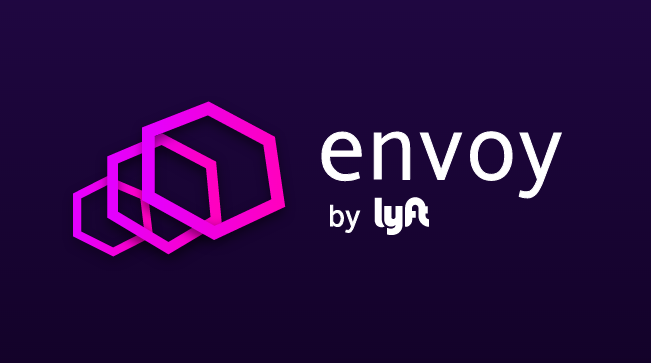

# 架构

## 整体架构

Istio服务网格分为两大块:数据面板和控制面板。

* 数据面板是由一组的作为sidecar部署，调停和控制微服务之间的所有网络通信的智能代理（Envoy）组成的。

* 控制面板 负责管理和配置代理来路由通讯，以及在运行时执行策略。

以下分别介绍 istio 中的主要模块 Envoy/Mixer/Pilot/Auth.

注: 下面的内容,尤其图片,主要来自istio官方文档和演讲的PDF.

## Envoy

Istio 使用 Envoy 代理的扩展版本，Envoy 是以C++开发的高性能代理，用于调解服务网格中所有服务的所有入站和出站流量。

Istio利用了Envoy的许多内置功能，例如动态服务发现，负载均衡，TLS termination，HTTP/2&gRPC代理，熔断器，健康检查，基于百分比流量拆分的分段推出，故障注入和丰富的metrics。

Envoy实现了过滤和路由、服务发现、健康检查，提供了具有弹性的负载均衡。它在安全上支持TLS，在通信方面支持gRPC.

## Mixer

Mixer 翻译成中文是 混音器, 下面是它的图标:

功能概括: Mixer 负责在服务网格上执行访问控制和使用策略，并收集Envoy代理和其他服务的遥测数据。代理提取请求级 属性，发送到 Mixer 进行评估。

### Mixer的设计背景

我们的系统通常会基于大量的基础设施而构建, 这些基础设施的后端服务用于提供为业务服务提供各种支持功能。包括访问控制系统，遥测捕获系统，配额执行系统，计费系统等。在传统设计中, 服务直接与这些后端系统集成，容易产生硬耦合.

在istio中,为了避免应用程序的微服务和基础设施的后端服务之间的耦合, 提供了 Mixer 作为两者的通用中介层:

Mixer 设计将策略决策从应用层移出并用配置替代，并在运维人员控制下。应用程序代码不再将应用程序代码与特定后端集成在一起，而是与Mixer进行相当简单的集成，然后 Mixer 负责与后端系统连接。

特别提醒: Mixer **不是**为了在基础设施后端之上创建一个抽象层或者可移植性层。也不是试图定义一个通用的logging API，通用的metric API，通用的计费API等等。

Mixer的设计目标是减少业务系统的复杂性，**将策略逻辑从业务的微服务的代码转移到Mixer中**, 并且改为让运维人员控制。

### Mix的功能

Mixer 提供三个核心功能：

- 前提条件检查。允许服务在响应来自服务消费者的传入请求之前验证一些前提条件。前提条件可以包括服务使用者是否被正确认证，是否在服务的白名单上，是否通过ACL检查等等。

- 配额管理。使服务能够在多个维度上分配和释放配额，配额被用作相对简单的资源管理工具，以便在争取有限的资源时在服务消费者之间提供一些公平性。限速是配额的例子。

- 遥测报告。使服务能够上报日志和监控。在未来，它还将启用针对服务运营商以及服务消费者的跟踪和计费流。

在Istio内，Envoy 重度依赖 Mixer。

### Mixer的适配器

Mixer 是高度模块化和可扩展的组件。其中一个关键功能是抽象出不同策略和遥测后端系统的细节，允许 Envoy 和基于 Istio 的服务与这些后端无关，从而保持他们的可移植。

Mixer在处理不同基础设施后端的灵活性是通过使用通用插件模型实现的。单个的插件被称为适配器，它们允许 Mixer 与不同的基础设施后端连接，这些后台可提供核心功能，例如日志，监控，配额，ACL检查等。适配器使Mixer能够暴露一致的API，与使用的后端无关。在运行时通过配置确定确切的适配器套件，并且可以轻松指向新的或定制的基础设施后端。

这个图是官网给的, 不是很好理解, 我从 github 的代码中抓个图给大家展示一下目前已有的mix adapter:

## Pilot

Pilot 负责收集和验证配置并将其传播到各种Istio组件。它从Mixer和Envoy中抽取环境特定的实现细节，为他们提供独立于底层平台的用户服务的抽象表示。此外，流量管理规则（即通用4层规则和7层HTTP/gRPC路由规则）可以在运行时通过Pilot进行编程。

https://github.com/istio/pilot

## Istio-Auth

Istio-Auth 提供强大的服务到服务和最终用户认证，使用交互TLS，内置身份和凭据管理。它可用于升级服务网格中的未加密流量，并为运维人员提供基于服务身份而不是网络控制实施策略的能力。Istio的未来版本将增加细粒度的访问控制和审计，以使用各种访问控制机制（包括基于属性和角色的访问控制以及授权钩子）来控制和监视访问您的服务，API或资源的人员。

https://github.com/istio/auth

